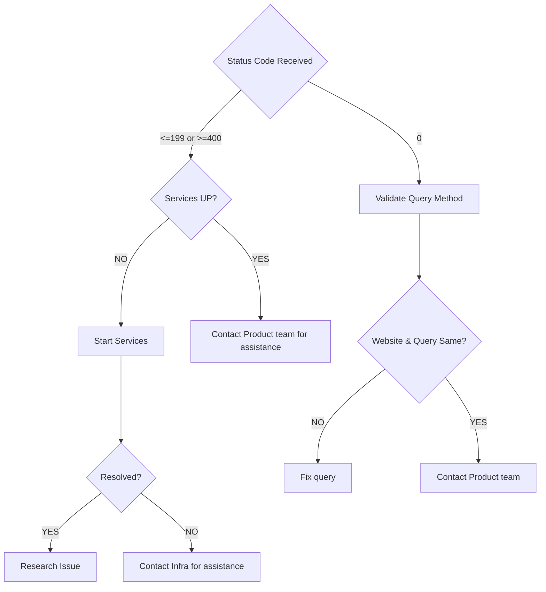

# website-status-code  

> *what to do when a alert received for website-status-code* 
general information on status codes can be found here: [httpstatuses](https://httpstatuses.com)  

---

---

### HTTP Status Code `<= 199 OR >= 400`

- [ ] Validate services are up on host servers    
  * UP?
    - [ ] **YES** - Pull recent changes and contact Product team  
    - [ ] **NO** - Start services
      * UP?
        - [ ] **YES** - 
          * Pull recent changes  
          * Research issue to understand why services went down and inform owning team  
        - [ ] **NO** - Contact Infra for assistance  

---

### HTTP Status Code `0`

- [ ] Validate query method (`HTTP or HTTPS`)  
- [ ] Open website  
  * Does it match query method?
    - [ ] **YES** - Website is HTTP & query is HTTP or Website is HTTPS & query is HTTPS  
      * Contact Product team to investigate scenarios for Response Code `0` in accordance with [W3C Spec](https://fetch.spec.whatwg.org/#concept-network-error)  
    - [ ] **NO** - Update query method in `alert-rules` to match  
      * Alert issue resolved?
        - [ ] **YES** - Close issue   
        - [ ] **NO** - Contact Product team for assistance  

---
