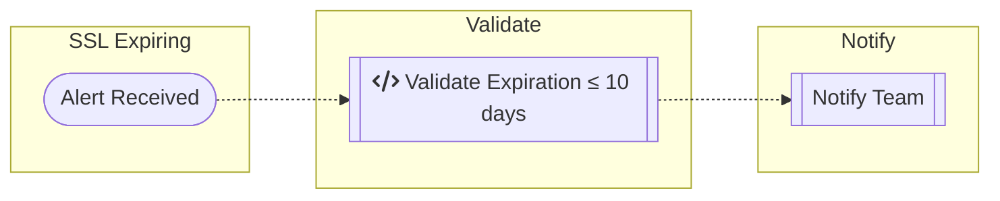

# website-ssl-expire  

> *what to do when a alert received for website ssl certificate expiring* 

---
  

---

- [ ] Validate that cert is expiring  
- [ ] verify with `script`  
  * Expiring?
    - [ ] **YES** - goto **[unresponsive-service](./unresponsive-service.md)**
    - [ ] **NO** - Start the service  
       * Did it start?
        - [ ] **YES** - Notify Team  
        - [ ] **NO** - Investigate False Alert  

---

### The mermaid code:  

Flowchart can be edited **[here](https://mermaid-js.github.io/mermaid-live-editor)**  

---

| Contact: |
| :---------: |
| **[Slack](https://101101workspace.slack.com/archives/D012ESWSXHQ "dsmith73 on 101101 workspace")**  / **[Discord](https://discord.gg/RmzVNzx)** |
|  |
