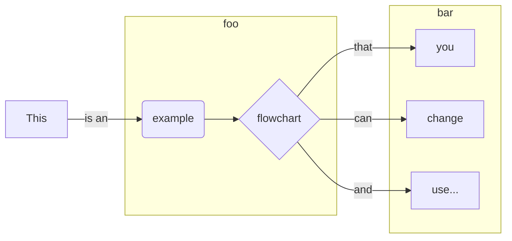

This is an example markdown document for a product named `product-x`

At the top we add the following to identify this doc- 
```yml
---
title: Example
permalink: /docs/product-x/example/
tags: 
 - product-x
 - example
 - alert-name
description: tell me something about this page
---

```

[](https://mermaid-js.github.io/mermaid-live-editor/#/edit/eyJjb2RlIjoiZ3JhcGggTFJcblx0QVtUaGlzXSAtLT58aXMgYW58IEJcbiAgXG4gIHN1YmdyYXBoIHN1YjEgW2Zvb11cblx0QihleGFtcGxlKSAtLT4gQ3tmbG93Y2hhcnR9XG4gIGVuZFxuXG4gIHN1YmdyYXBoIHN1YjIgW2Jhcl1cbiAgQyAtLT58dGhhdHwgRFt5b3VdXG5cdEMgLS0-fGNhbnwgRVtjaGFuZ2VdXG5cdEMgLS0-fGFuZHwgRlt1c2UuLi5dXG5cdGVuZFx0XHRcbiAgXHRcdCIsIm1lcm1haWQiOnsidGhlbWUiOiJkYXJrIn19)  

---

*Mermaid code*  


You can edit this [here]()  

---
 

| Contact: |
| :---------: |
| **[Slack](https://101101workspace.slack.com/archives/D012ESWSXHQ "dsmith73 on 101101 workspace")** |
|  |
