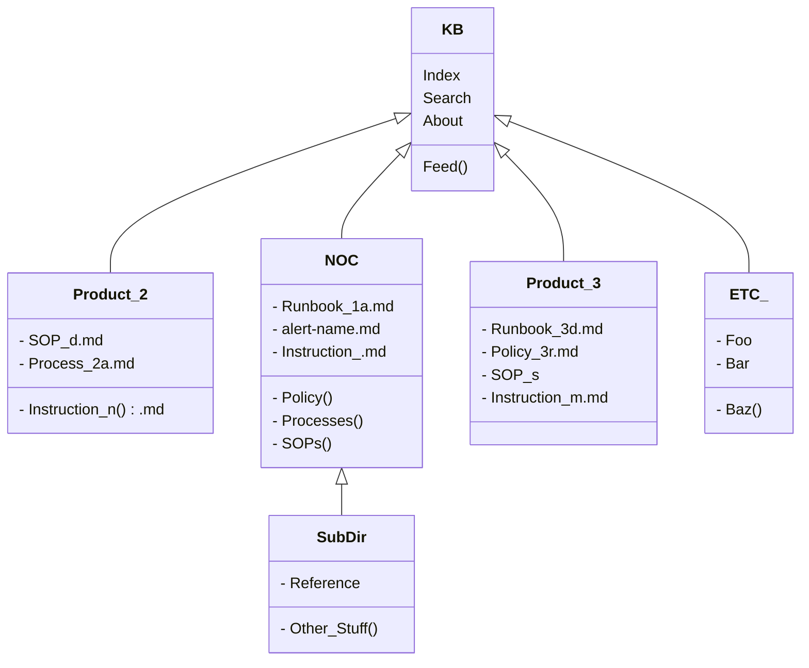

Use this section (`/_docs`) for runbooks...

The layout for this section is:

[](https://mermaid-js.github.io/mermaid-live-editor/#/edit/eyJjb2RlIjoiY2xhc3NEaWFncmFtXG5cdEtCIDx8LS0gUHJvZHVjdF8yXG5cdEtCIDx8LS0gTk9DXG4gIE5PQyA8fC0tIFN1YkRpclxuXHRLQiA8fC0tIFByb2R1Y3RfM1xuICBLQiA8fC0tIEVUQ19cblx0S0IgOiBJbmRleFxuXHRLQiA6IFNlYXJjaFxuXHRLQiA6IEZlZWQoKVxuICBLQiA6IEFib3V0XG5cdGNsYXNzIE5PQ3tcblx0XHQtIFJ1bmJvb2tfMWEubWRcbiAgICAtIFBvbGljeSgpXG4gICAgLSBQcm9jZXNzZXMoKVxuXHRcdC0gYWxlcnQtbmFtZS5tZFxuXHRcdC0gU09QcygpXG5cdFx0LSBJbnN0cnVjdGlvbl8ubWRcblx0fVxuXHRjbGFzcyBQcm9kdWN0XzJ7XG5cdFx0LSBTT1BfZC5tZFxuXHRcdC0gSW5zdHJ1Y3Rpb25fbigpLm1kXG4gICAgLSBQcm9jZXNzXzJhLm1kXG5cdH1cblx0Y2xhc3MgUHJvZHVjdF8ze1xuXHRcdC0gUnVuYm9va18zZC5tZFxuICAgIC0gUG9saWN5XzNyLm1kXG5cdFx0LSBTT1Bfc1xuICAgIC0gSW5zdHJ1Y3Rpb25fbS5tZFxuXHR9XG5cdGNsYXNzIEVUQ197XG5cdFx0LSBGb29cbiAgICAtIEJheigpXG4gICAgLSBCYXJcblx0fVxuXHRjbGFzcyBTdWJEaXJ7XG5cdFx0LSBSZWZlcmVuY2VcbiAgICAtIE90aGVyX1N0dWZmKClcblx0fSIsIm1lcm1haWQiOnsidGhlbWUiOiJmb3Jlc3QifSwidXBkYXRlRWRpdG9yIjpmYWxzZX0)  

---

*Mermaid code*  

This can be edited [here](https://mermaid-js.github.io/mermaid-live-editor)  

 ---
 

| Contact: |
| :---------: |
| **[Slack](https://101101workspace.slack.com/archives/D012ESWSXHQ "dsmith73 on 101101 workspace")** |
|  |
